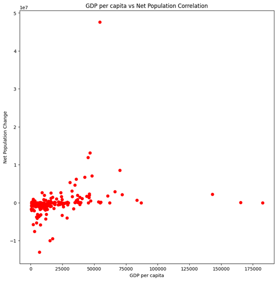
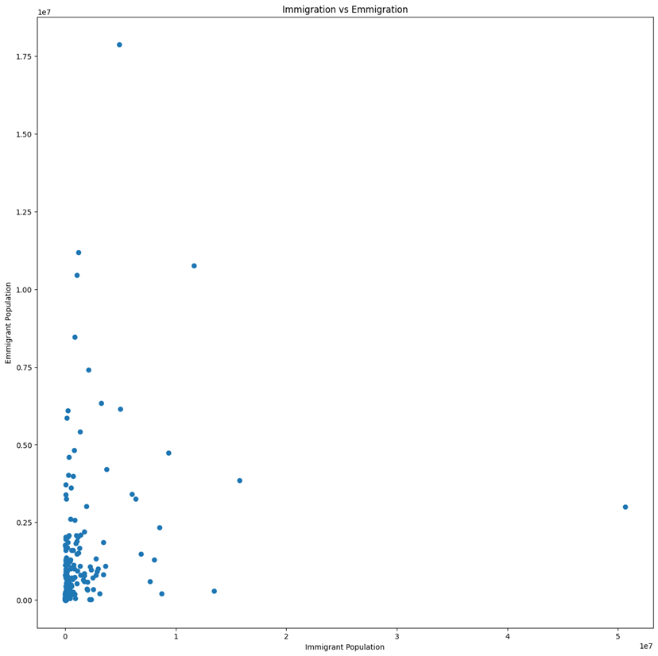
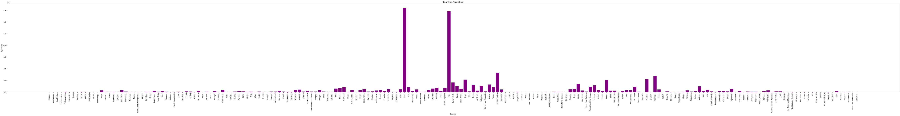
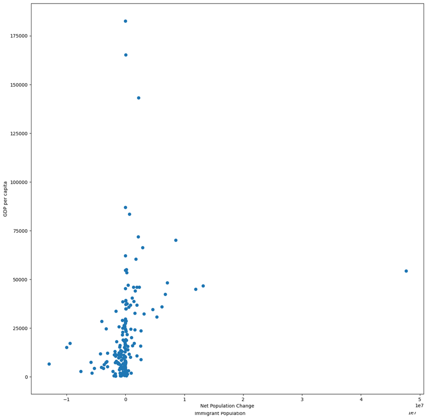
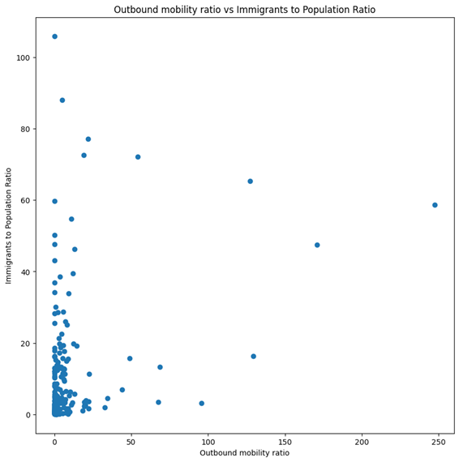
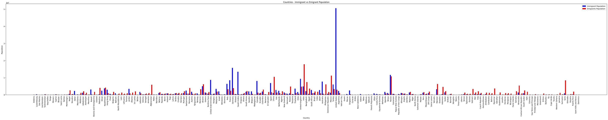

# 🌍 Human Capital Migration Analysis — Global Trends

> *What drives people to leave their country — and where do they go? This project explores global migration patterns using economic and population indicators to uncover hidden trends.*

---

## 👔 Project Overview

<table>
  <tr>
    <th>Field</th>
    <th>Details</th>
  </tr>
  <tr>
    <td>Author</td>
    <td>Sanskar Shrivas</td>
  </tr>
  <tr>
    <td>Date</td>
    <td>May, 2026</td>
  </tr>
  <tr>
    <td>Tools Used</td>
    <td>Python (Pandas, NumPy, Matplotlib)</td>
  </tr>
  <tr>
    <td>Dataset</td>
    <td>Global Immigration & Emigration Statistics</td>
  </tr>
  <tr>
    <td>Records</td>
    <td>201 countries</td>
  </tr>
</table>

---

## 📁 Project Structure

```
Migration-Analysis/
│
├── data/
│   └── data.csv                  # Main dataset (201 countries)
├──visuals
│  └── 1.png
│  └── 2.png
│  └── 3.png
│  └── 4.png
│  └── 5.png
│  └── 6.png
├── analysis.ipynb               # Complete analysis notebook
└── README.md                    # Project documentation
```

---

## ⚙️ How to Run

### Prerequisites

* Python 3.x
* Jupyter Notebook / Google Colab
* Required libraries:

```bash
pip install pandas numpy matplotlib
```

### Steps

**1. Load the dataset**

```python
import pandas as pd
df = pd.read_csv('data.csv')
```

**2. Run the notebook**

Execute all cells in `analysis.ipynb` step-by-step:

* Data loading
* Cleaning
* Exploratory Data Analysis
* Visualizations

---

## 🎯Key Analytical Questions Answered

1. Which countries have the highest and lowest net population change?
2. Is there a relationship between GDP per capita and migration?
3. Which countries have the highest outbound mobility?
4. How do immigration and emigration ratios compare globally?
5. What patterns exist between economic strength and migration trends?

---

## 🔍 Key Findings

> ### 1) Clean dataset — no null values or duplicates

```python
df.isnull().sum()
df.duplicated().sum()
```

**Result:**
<table>
  <tr>
    <th> </th>
    <th>0</th>
  </tr>
  <tr>
    <td>Country</td>
    <td>0</td>
  </tr>
  <tr>
    <td>Population</td>
    <td>0</td>
  </tr>
  <tr>
    <td>Emigrants Population</td>
    <td>0</td>
  </tr>
  <tr>
    <td>Immigrants Population</td>
    <td>0</td>
  </tr>
  <tr>
    <td>Net Population Change</td>
    <td>0</td>
  </tr>
  <tr>
    <td>Net Population Change to Total population Ratio</td>
    <td>0</td>
  </tr>
   <tr>
    <td>Outbound mobility Ratio</td>
    <td>0</td>
  </tr>
  </tr>
   <tr>
    <td>Emmigrant to Total population Ratio</td>
    <td>0</td>
  </tr>
  </tr>
   <tr>
    <td>Immigrant to Total population Ratio</td>
    <td>0</td>
  </tr>
  </tr>
   <tr>
    <td>GDP per capita</td>
    <td>0</td>
  </tr>
</table>
---

> ### 2) United States has the highest net population gain

```python
print("Maximum :")
res=df[['Country','Net Population Change']].sort_values(by='Net Population Change',ascending=False).iloc[0]
print(res)
```

**Result:**
Maximum :
Country                  United States
Net Population Change         47636613
Name: 111, dtype: object

---

> ### 3) India shows the highest net population loss

```python
print("Minimum :")
res=df[['Country','Net Population Change']].sort_values(by='Net Population Change',ascending=True).iloc[0]
print(res)
```

**Result:**
```
Minimum :
Country                      India
Net Population Change    -12990788
Name: 99, dtype: object
```
---

> ### 4) Weak positive correlation between GDP and migration

```python
res = df['GDP per capita'].corr(df['Net Population Change'])
print(res)

x=df['GDP per capita']
y=df['Net Population Change']
plt.figure(figsize=(10,10))
plt.scatter(x,y,color='red')
plt.xlabel('GDP per capita')
plt.ylabel('Net Population Change')
plt.title('GDP per capita vs Net Population Correlation')
plt.show()
```

**Result:**
```
0.27099217683594523
```


👉 Interpretation:
Higher GDP countries *tend* to attract more migrants, but it's not a strong dependency.

---

> ### 5) Extreme outbound mobility variation across countries
```python
res=df.sort_values(by='Outbound mobility ratio',ascending=False).iloc[0]['Country']+" - "+df.sort_values(by='Outbound mobility ratio',ascending=False).iloc[0]['Outbound mobility ratio']
print("Highest Outbound mobility ratio :\n"+res)
print('---------------------------------')
res=df.sort_values(by='Outbound mobility ratio',ascending=True).iloc[0]['Country']+" - "+df.sort_values(by='Outbound mobility ratio',ascending=True).iloc[0]['Outbound mobility ratio']
print("Lowest Outbound mobility ratio :\n"+res)
```
Result:
```
Highest Outbound mobility ratio :
Turkmenistan - 95.54%
---------------------------------
Lowest Outbound mobility ratio :
Dominica - 0.00%
```

👉 Indicates massive disparity in migration pressure globally.

---

> ### 6) Immigration vs Emigration patterns show imbalance

```python
x=df['Immigrant Population']
y=df['Emigrants Population']
plt.figure(figsize=(15,15))
plt.scatter(x,y)
plt.xlabel('Immigrant Population')
plt.ylabel('Emmigrant Population')
plt.title('Immigration vs Emmigration')
```

Scatter analysis reveals:

* Some countries are strong **net receivers**
* Others are heavy **net senders**



👉 Migration is not evenly distributed — it's concentrated.

---

## 📊 Visualizations

### 1) Country Population Distribution

* Bar chart of population across countries


### 2) Immigration vs Emigration


### 3) GDP vs Net Population Change

* Economic influence on migration

### 4) Outbound Mobility vs Immigration Ratio

* Movement vs attraction comparison
  

---

### 5) Immigration and emmigration comparision across the countries



## 🧠 Insights & Interpretation

* Migration is heavily influenced by **economic opportunity**, but not solely determined by it
* High GDP countries attract people, but **policy, geography, and stability** also matter
* Some countries experience extreme outbound migration → possible indicators of:

  * Economic stress
  * Limited opportunities
* Global migration patterns are **asymmetric and clustered**

---

## ⚡ Key Takeaways 

- Global migration is highly uneven — a few countries attract most migrants
- Economic strength (GDP) influences migration, but weakly (~0.27 correlation)
- Some countries show extreme outbound mobility → potential economic or social stress
- Migration patterns are clustered, not evenly distributed globally
-Correlation does not imply causation — GDP alone cannot explain migration patterns.

## 🗂️ Future Improvements

* Add time-series data for trend analysis
* Include regional clustering (continent-wise insights)
* Build predictive models for migration patterns
* Integrate external datasets (employment rate, HDI, etc.)

---

*— End of README —*
